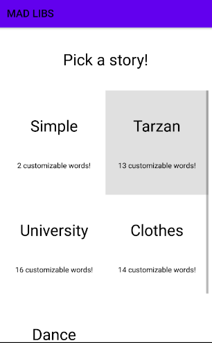
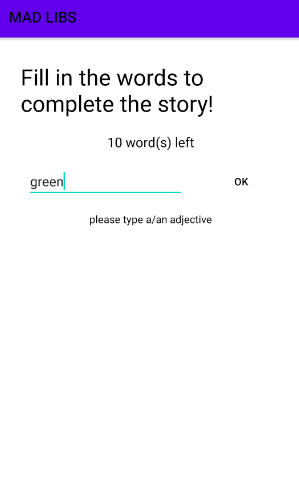

# NAS19-madlibs

This app allows the user to create their own customized stories. Includes a menu to choose story templates from, interface for obtaining user input, and story screen to show the end result. Implements proper back navigation.

## Main activity screen

## Story Picker

## Obtaining and validating user input

## Portrait and landscape mode, memory management example

## Finalized story

